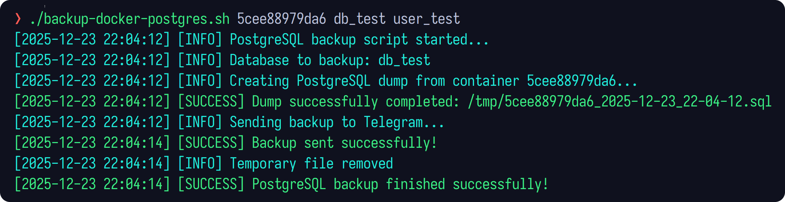
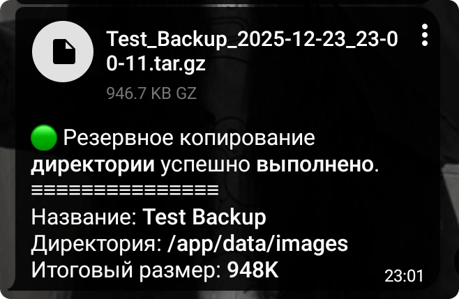
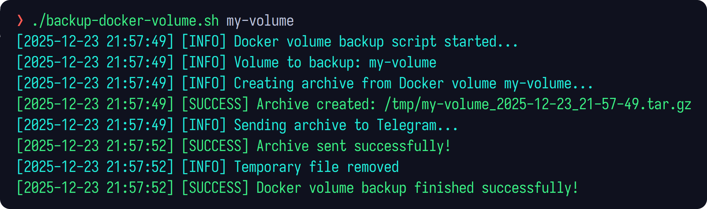
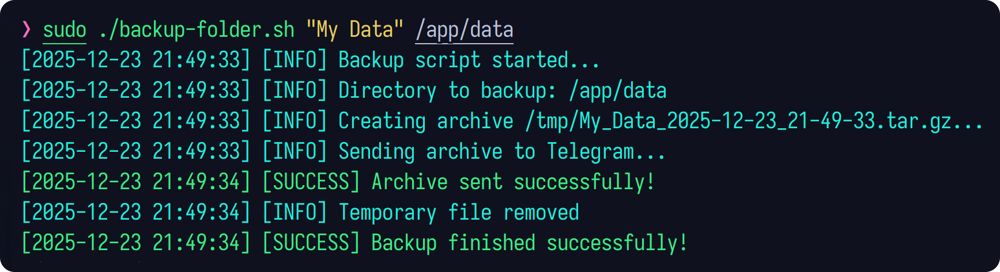

<table>
  <tr>
    <td></td>
    <td></td>
  </tr>
</table>

Simple **bash scripts** for creating **backups** and sending them to Telegram.

# 🔩 Running scripts

To use **any** script, make the file **executable**:
```bash
chmod +x backup-folder.sh
chmod +x backup-docker-volume.sh
chmod +x backup-docker-postgres.sh
```

## Backup folder

You must specify the **backup name** and **path** to the directory.

**Usage:**
```bash
backup-folder.sh <backup_name> <directory_path>
```

**Examples:**
```bash
backup-folder.sh Name ./images
backup-folder.sh "Few words" /var/log/nginx
```

## Backup volume (Docker)

You must specify the **volume name**. The script will **automatically** check if it **exists**.

**Usage:**
```bash
backup-docker-volume.sh <docker_volume>
```

**Examples:**
```bash
backup-docker-volume.sh pg-data
backup-docker-volume.sh random-volume  # Docker volume does not exist: random-volume
```

> [!WARNING]
> When this script is executed **inside another Docker container**, there is an important limitation to be aware of.
>
> By default, the backup archive is created **on the host filesystem**.
> If the script itself is running inside a container, it **will not have access to the host filesystem**, and therefore **will not be able to send the created backup file to Telegram**.
>
> To avoid this issue, you can use a **streaming approach**.
>
> Example **implementation**:
> ```bash
> # Creating & sending backup
> send_backup_stream() {
>   local timestamp archive_name size caption
> 
>   timestamp="$(date '+%Y-%m-%d_%H-%M-%S')"
>   archive_name="${VOLUME_NAME// /_}_${timestamp}.tar.gz"
> 
>   info "Creating and sending archive from Docker volume ${VOLUME_NAME}..."
> 
>   size="$(
>     docker run --rm \
>       -v "${VOLUME_NAME}:/data:ro" \
>       alpine \
>       sh -c 'tar -cz -C /data . | wc -c'
>   )"
> 
>   caption="$(cat <<EOF
> 🟢 Docker volume backup completed successfully.
> ≡≡≡≡≡≡≡≡≡≡≡≡≡≡≡
> Volume: <b>${VOLUME_NAME}</b>
> Backup size: <b>$(numfmt --to=iec "$size")</b>
> EOF
> )"
> 
>   if ! docker run --rm \
>    -v "${VOLUME_NAME}:/data:ro" \
>     alpine \
>     tar -cz -C /data . | \
>   curl -sS -X POST \
>     "https://api.telegram.org/bot${TELEGRAM_BOT_TOKEN}/sendDocument" \
>     -F chat_id="$TELEGRAM_CHAT_ID" \
>     -F "document=@-;filename=${archive_name}" \
>     -F caption="$caption" \
>     -F parse_mode="HTML" \
>     > /dev/null
>   then
>     error "Docker volume backup failed"
>     return 1
>  fi
>
>   success "Archive sent successfully!"
> }
> ```

> [!CAUTION]
> When backing up a **directory** or a **Docker volume**, the data may be **actively modified** at the time of backup (for example by an application, service, or database).
>
> In such cases, the backup:
> - may contain partially written files
> - may become inconsistent
> - may fail to restore correctly later

## Backup postgres (Docker)

You must specify the **container name** (or **id**), **database name**, and **user name**.

**Usage:**
```bash
backup-docker-postgres.sh <postgres_container> <db_name> <db_user>
```

**Examples:**
```bash
backup-docker-postgres.sh 5cee88979da6 my-database my-user
backup-docker-postgres.sh random-name db user  # Docker container does not exist: random-name
```

## 🖼️ Other images

<table align="center">
  <tr>
    <td></td>
  </tr>
  <tr>
    <td></td>
  </tr>
</table>
